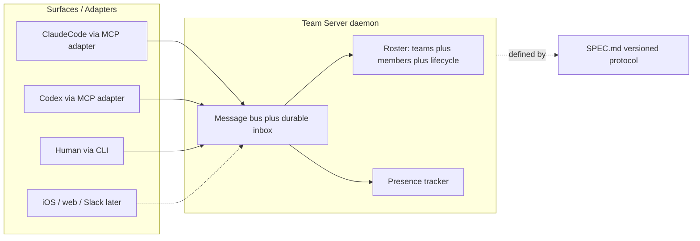

# Agent+Human Team Coordination Layer

## The one-liner

**Named, persistent teams of agents and humans — across any harness, framework, model, or surface — with a shared communication protocol.** Humans are first-class members, not approvers. The wedge nobody else covers: MCP connects agents to tools, A2A connects agents to agents per-request — neither models *persistent teams with identity, presence, and humans as peers*.

## Core design: identity / presence / transport split

The load-bearing idea (from your cross-surface requirement):

- **Member** = durable identity (name, kind: `agent|human`, role free-text, team memberships, lifecycle: `forever | session | until <ts>`, availability schedule). Not a session.
- **Presence** = where a member is currently attached: a Claude Code session, a Codex session, a CLI, later an iOS app. Same member, multiple possible surfaces — like a human on Slack desktop + phone.
- **Transport** = the team server routes messages to wherever members are present; offline members get an inbox (durable mailbox).

## Protocol (SPEC.md, versioned from first commit)

- Message envelope: `{id, team, from, to (member|team|broadcast), act, body, thread, ts}`.
- **Collaboration acts** (Co-Gym-inspired): `message`, `status_update`, `request_help`, `handoff`, `accept/decline`, `wait`. Acts are the research-grade part — citable position, grounded in the Co-Gym paper.
- Spec notes streaming granularity (StreamMA finding: step-level streaming beats wait-for-complete) as a v2 transport option.
- Roadmap sections written but not built: schedule *enforcement*, sandboxed runtime, team-to-team federation, additional surfaces. Schema fields for these exist from day one so nothing is designed into a corner.

## v1 flagship scenario (the README demo)

A real repo, three terminal panes: Claude Code session (agent "Ada"), Codex session (agent "Lin"), and you (`musterd inbox --watch`). They split work, post `status_update`s, one issues a `request_help`, you answer as a peer. 90-second recording. This productizes the MoveTrail multi-session workflow.

## Stack & repo layout (TypeScript, in `/Users/nick/agents`)

Monorepo (pnpm workspaces):

- `packages/server` (`@musterd/server`) — the daemon: SQLite (better-sqlite3) store, WebSocket + HTTP API, presence + inbox
- `packages/cli` (`musterd`, unscoped) — human surface: `musterd team create/add/join`, `musterd send/inbox/status` (npx-installable)
- `packages/mcp` (`@musterd/mcp`) — the universal harness adapter: one MCP server exposing `team_send`, `team_inbox_check`, `team_status`, `team_members`; any MCP-capable harness connects → its agent joins the team. Harness-agnosticism for free.
- `packages/protocol` (`@musterd/protocol`) — shared types + zod schemas, generated from the spec
- `SPEC.md`, `README.md`, `ROADMAP.md` (runtime/sandboxes/federation/surfaces), `LICENSE` (MIT)
- Python client SDK = fast follow after launch, not v1.

## Phase 0: Planning docs (before implementation)

Everything below is authored so that **a much less capable agent can execute end-to-end without judgment calls** — but every doc opens with the same **living-document preamble**:

> This document is the initial direction, not gospel. It will evolve. If you (the executing agent) find an error, contradiction, or better approach during implementation: (1) do not silently deviate — record the issue and your proposed change in `docs/decisions/NNN-<slug>.md` (a short ADR: context, problem, decision, consequences), (2) make the smallest correct change, (3) update the affected doc in the same commit. Docs and code must never disagree at the end of a commit.

### docs/design/ — UI/UX (Figma executed by a separate, cheaper agent)

We do not produce Figma work in this session. We produce **execution briefs** precise enough that a Figma-capable agent (with the Figma MCP + skills) can create and iterate the files alone. Three briefs plus one source-of-truth spec:

1. **`brand.md`** — the source of truth the briefs derive from: wordmark rules (ASCII + vector), mustard palette with exact hex ramps (e.g. accent `#E1AD01` family + zinc neutrals), typography (one mono for terminal/code, one sans for docs/web), voice/tone rules, terminology glossary (Team, Member, Presence, Surface, Act)
2. **`figma-brief-brand.md`** — Figma file 1 "musterd / Brand": pages (Wordmark, Color, Type, Assets), exact frames to create (README header 1280x320, social card 1200x630, npm/GitHub avatar 512x512), color/type variables to define, acceptance checklist (every asset exported at listed sizes/formats)
3. **`figma-brief-terminal.md`** — Figma file 2 "musterd / Terminal UX": one frame per CLI command output (`team create`, `team add`, `join`, `send`, `inbox`, `inbox --watch`, `status`, error states, empty states), built on a terminal grid component (80-col, mono type ramp, ANSI color styles mapped to brand palette); these frames ARE the CLI output spec — the CLI implementation must match them
4. **`figma-brief-dashboard.md`** — Figma file 3 "musterd / Dashboard" (designed now, built post-v1 per roadmap): screens (team roster, member detail w/ presence + lifecycle, message timeline w/ act types, team settings), light+dark, component-first (define Member chip, Presence dot, Act badge, Message row as components before screens), flows for the 3 core journeys (watch a team work, answer a request_help, add a member)

Each brief specifies: file name, page structure, every frame with dimensions, components + variants to build first, variables/tokens to bind, what "done" means (checklist), and an **iteration protocol** (designer agent posts screenshots for review; revisions only against named frames).

### docs/architecture/ — file-level implementation docs

Maximum prescriptiveness: every file named, every exported function signature given, build order explicit, acceptance tests per module. Documents:

- **`00-overview.md`** — system diagram, package dependency graph, build order (protocol → server → cli → mcp), the living-doc preamble explained
- **`01-data-model.md`** — complete SQLite DDL (teams, members, memberships, presence, messages, inbox_cursors), every column typed + commented, migration strategy, seed data for tests
- **`02-protocol.md`** — distilled from SPEC.md: envelope JSON schema, all acts with required/optional fields, WS connection lifecycle (hello → authenticated → subscribed), HTTP endpoint table (method, path, request/response shapes, error codes)
- **`03-server.md`** — file tree of `packages/server/src/`, each module's exports with TS signatures, startup sequence, presence heartbeat rules (timeout values), inbox delivery semantics (at-least-once, cursor-based)
- **`04-cli.md`** — every command: args, flags, exact output format (referencing the Figma terminal frames), exit codes, config file location/shape (`~/.musterd/config.json`)
- **`05-mcp.md`** — the 4 tools' JSON schemas verbatim, connection/identity bootstrapping (how an MCP session binds to a Member), reconnect behavior
- **`06-testing.md`** — test pyramid (vitest unit, integration via in-memory SQLite + real WS), the acceptance scenario scripts (two humans on one team; agent + human; the flagship 3-pane scenario as an automated test), coverage gates
- **`07-conventions.md`** — TS config, lint rules, error handling pattern, logging format, commit message format, "definition of done" per task

### AGENTS.md — execution contract at repo root

For the implementing agent(s): read order (00 → 07), build order, verification command per milestone (`pnpm test`, scenario scripts), the deviation/ADR protocol, and hard rules (never change `@musterd/protocol` schemas without an ADR; CLI output must match Figma terminal frames; docs updated in same commit as code).

## Milestones

0. **Planning docs** — author `docs/design/` (brand spec + 3 Figma briefs), `docs/architecture/` (00–07), `AGENTS.md`
1. **Scaffold + spec v0.1** — repo, workspaces, SPEC.md draft with envelope + acts + lifecycle/presence model; reserve `musterd` on npm early (placeholder 0.0.1 publish) so the name can't be squatted
2. **Server core** — teams/members/messages/presence in SQLite, WS+HTTP API
3. **CLI** — human membership end-to-end (two humans on one team works)
4. **MCP adapter** — Claude Code joins a team; then Codex
5. **Flagship demo** — the 3-pane scenario on a real repo, recorded
6. **Launch polish** — README with demo gif, positioning vs MCP/A2A/Fleet/CrewAI, HN/Twitter post

## Out of scope for v1 (explicitly on ROADMAP.md)

Sandbox runtime, schedule enforcement (schema only), team-to-team federation, iOS/web surfaces, Python SDK, model-level integrations (frameworks join via MCP or the WS API).

## Branding & opinions (minimal, reversible, from day one)

**Opinionated perspectives** — stated as numbered principles in `README.md` (a short "Principles" section, not a separate manifesto file yet — easy to expand or walk back):

1. **Humans are members, not approvers.** No bolted-on "human-in-the-loop" mode — humans use the same envelope, same acts, same inbox as agents.
2. **An agent is an identity, not a session.** Sessions come and go; the member persists. Presence is where you are, not who you are.
3. **Teams are persistent.** Coordination outlives any single task or session.
4. **Protocol over framework.** We don't run your agent — we connect it. Small core, adapters at the edge.
5. **One member does the work; the team does the coordination.** The research is clear that multi-agent isn't magic: MAS gains over single agents are often minimal, and ~79% of MAS failures are coordination failures, not capability failures (MAST, arXiv 2503.13657; see also 2604.02460, 2505.18286). musterd never forces decomposition — a team of one agent (plus optionally a human) is a first-class, even default, configuration. The framework's value is persistence, identity, presence, and human partnership — not splitting tasks into more agents. Use one strong member per task; add members for true parallelism, separate surfaces, or human collaboration.
6. **Local-first.** SQLite + a local daemon. No account, no cloud required to use it.

**Design consequences of principle 5** (so it's structural, not just words):

- No minimum team size: `musterd team create` + one agent works; nothing in the schema or CLI assumes N>1 agents
- No built-in task decomposition, planner, or orchestrator role — members decide how to split work (or not)
- Positioning angle for launch: MAST found ~79% of multi-agent failures are *coordination* failures (lost context in handoffs, misalignment) — which is exactly the layer musterd is: explicit identity, durable inboxes, typed collaboration acts instead of ad-hoc handoffs

**Branding scope (deliberately minimal):**

- Name + one-line tagline + consistent terminology glossary (Team, Member, Presence, Surface, Act) used identically in spec, CLI output, and docs
- ASCII wordmark in CLI banner / README header — no logo/design work yet
- Consistent voice: plain, declarative, no hype
- All of it lives in README + SPEC terminology section — fully reversible

**Name: `musterd`** (chosen — npm unscoped free)

- muster ("assemble the team" / "roll call" = presence) + the `-d` daemon convention, with a mustard pun for personality
- Tagline draft: *"Muster your agents and humans into persistent teams."*
- Packages: unscoped `musterd` = the CLI + daemon entry point; `@musterd/server`, `@musterd/mcp`, `@musterd/protocol` for the rest of the monorepo
- CLI bin: `musterd` (e.g. `musterd send`, `musterd inbox --watch`, `musterd status`)
- Mustard yellow as the single accent color (CLI banner, future README badge) — the entire visual identity for now, fully reversible

